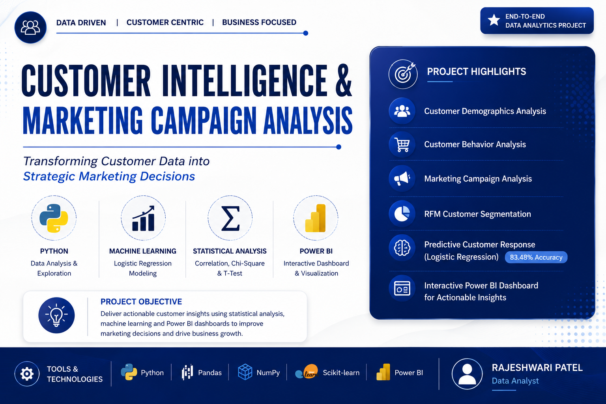

<p align="center">
  
</p>

# Customer Intelligence & Marketing Campaign Analysis

An end-to-end Data Analytics project that leverages **Python, Statistical Analysis, Machine Learning, and Power BI** to analyze customer behavior, evaluate marketing campaign performance, identify high-value customer segments, and generate actionable business insights for data-driven decision-making.

---

## Project Overview

The objective of this project is to understand customer demographics, purchasing behavior, campaign effectiveness, and customer segmentation to support strategic marketing decisions. The project combines exploratory data analysis, statistical hypothesis testing, predictive modeling, and interactive Power BI dashboards.

---

## Business Objectives

- Analyze customer demographics and purchasing behavior.
- Evaluate marketing campaign performance.
- Identify high-value customer segments using RFM Analysis.
- Predict customer campaign response using Machine Learning.
- Generate actionable business insights to improve marketing ROI.

---

## Tools & Technologies

- Python
- Pandas
- NumPy
- Matplotlib
- Seaborn
- Scikit-learn
- Statistical Analysis
- Power BI

---

## Project Workflow

```
Data Collection
        ↓
Data Cleaning
        ↓
Feature Engineering
        ↓
Exploratory Data Analysis
        ↓
Statistical Analysis
        ↓
Customer Segmentation (RFM)
        ↓
Machine Learning
        ↓
Power BI Dashboard
        ↓
Business Insights & Recommendations
```

---

# Statistical Analysis

The following statistical techniques were applied to validate business assumptions and customer behavior.

### Pearson Correlation Test
- Objective: Analyze the relationship between customer income and total spending.
- Result: A statistically significant positive correlation was observed, indicating that customers with higher income tend to spend more.

### Chi-Square Test
- Objective: Determine whether customer characteristics influence campaign response.
- Result: A significant association was identified between customer attributes and campaign acceptance.

### Independent T-Test
- Objective: Compare spending behavior between different customer groups.
- Result: Spending behavior differed significantly across customer groups.

---

# Machine Learning

## Logistic Regression

**Objective**

Predict whether a customer is likely to accept a marketing campaign.

**Model Accuracy**

**83.48%**

---

# Power BI Dashboard

The interactive dashboard consists of five analytical pages.

### Executive Dashboard
- Business KPIs
- Revenue Overview
- Purchase Channels
- Income Analysis

### Customer Demographics
- Income Distribution
- Age Distribution
- Education Analysis
- Family Composition
- Marital Status

### Customer Behavior
- Spending Analysis
- Customer Engagement
- Purchase Frequency
- Recency Analysis

### Campaign Analysis
- Campaign Acceptance
- Revenue by Education
- Purchase Group Analysis
- Family Size Analysis
- Campaign Response Analysis

### Customer Segmentation (RFM)
- Champions
- Loyal Customers
- Potential Customers
- At-Risk Customers
- Revenue Contribution
- Customer Response

---

# Dashboard Preview

## Executive Dashboard


---

## Customer Demographics


---

## Customer Behavior


---

## Campaign Analysis


---

## Customer Segmentation


---

## Insights & Recommendations


---

# Key Business Insights

- Wines generated the highest revenue among all product categories.
- Physical stores remained the dominant purchase channel.
- High-income customers demonstrated greater spending behavior.
- Customer engagement positively influenced customer spending.
- Champions and Loyal Customers generated the highest business value.
- At-Risk customers require targeted retention strategies.
- Customer segmentation significantly improved campaign targeting opportunities.

---

# Business Recommendations

- Focus marketing campaigns on high-value customer segments.
- Strengthen retention strategies for At-Risk customers.
- Increase customer engagement through personalized marketing.
- Expand promotional efforts for high-performing product categories.
- Leverage predictive analytics for future campaign targeting.

---

# Repository Contents

```
📂 Dataset
📂 Jupyter Notebook
📂 Power BI Dashboard (.pbix)
📂 PowerPoint Presentation
📂 Dashboard Screenshots
📂 Cover Banner
```

---

# Author

**Rajeshwari Patel**

Data Analyst

LinkedIn: *(Add your LinkedIn profile)*

GitHub: *(Add your GitHub profile)*

---

## If you found this project useful, please consider giving it a ⭐ on GitHub.
