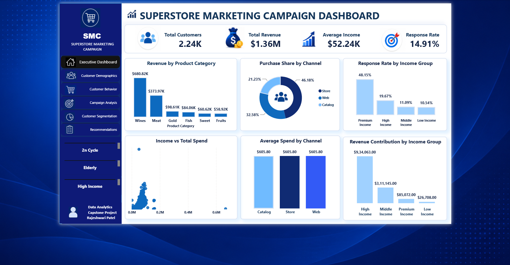
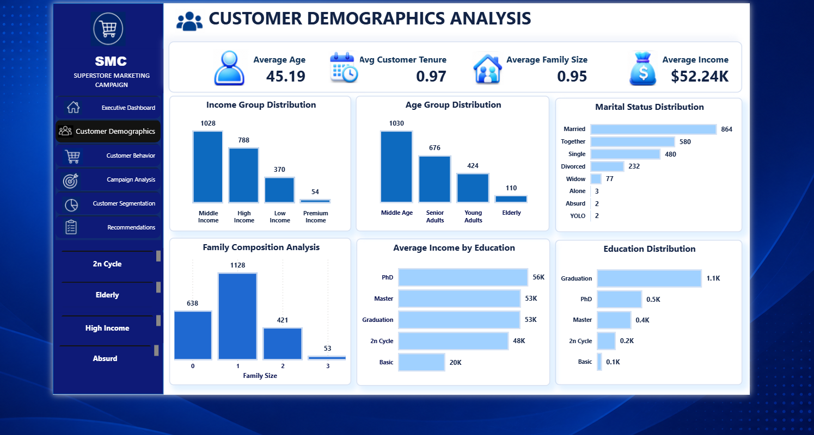
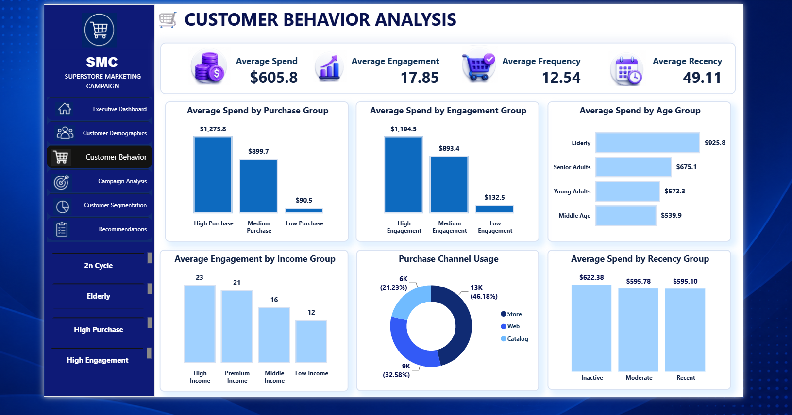
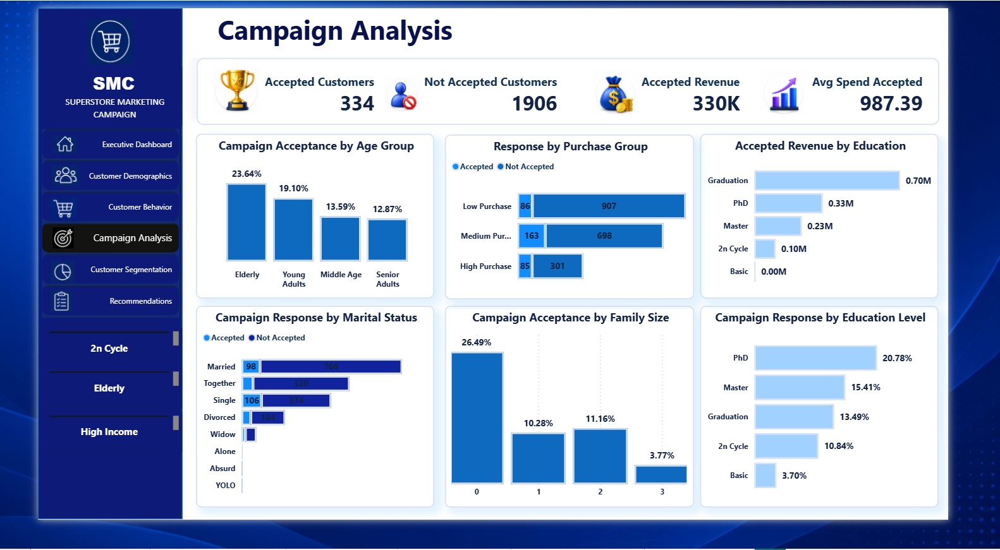
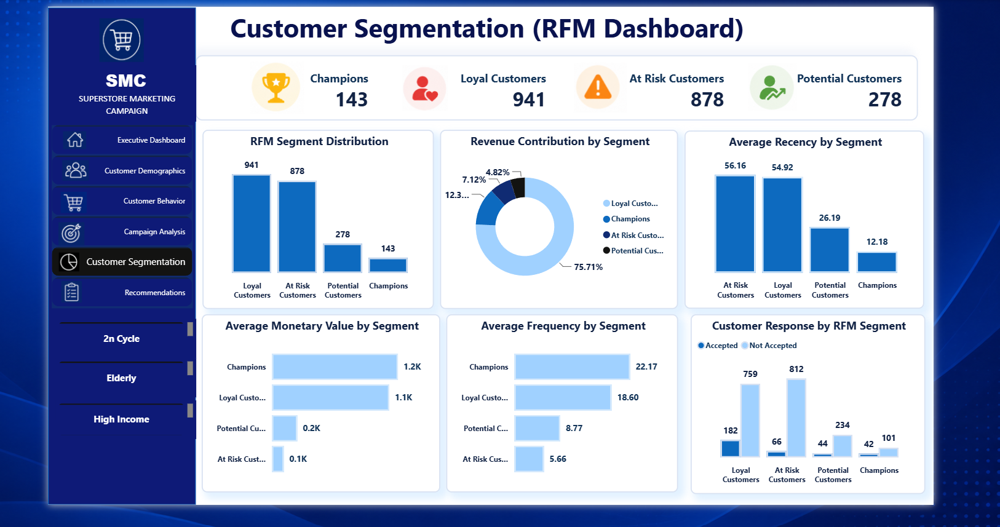
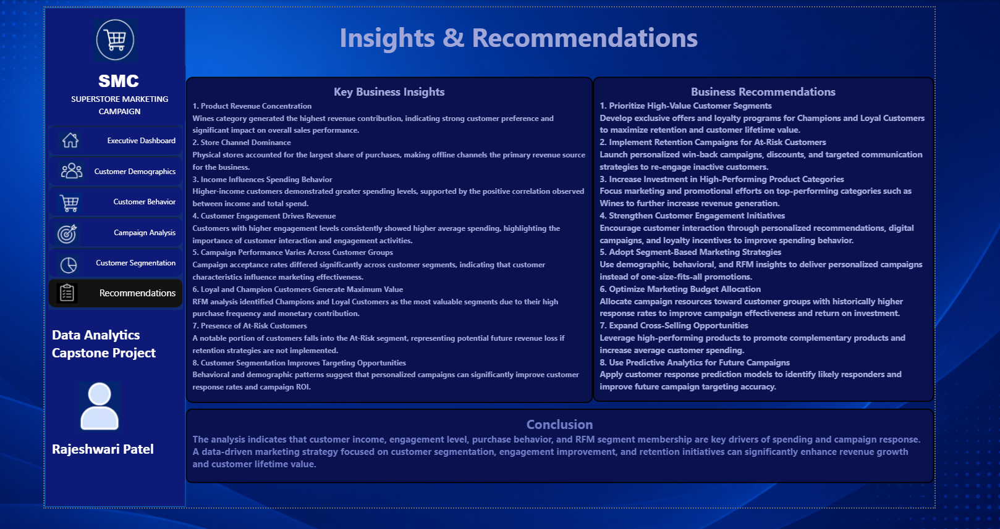

````markdown


# Customer Intelligence & Marketing Campaign Analysis

<p align="center">


</p>

---

# Project Overview

This project presents an end-to-end Customer Analytics solution that integrates Python, Statistical Analysis, Machine Learning, and Power BI to analyze customer demographics, purchasing behavior, campaign performance, customer segmentation, and response prediction.

The objective is to generate actionable business insights that support data-driven marketing decisions and improve campaign effectiveness.

---

# Business Objectives

- Analyze customer demographics and purchasing behavior.
- Identify high-value customers.
- Evaluate marketing campaign performance.
- Perform customer segmentation using RFM Analysis.
- Predict customer campaign response.
- Build an interactive Power BI Dashboard.

---

# Tools & Technologies

- Python
- Pandas
- NumPy
- Matplotlib
- Seaborn
- Scikit-learn
- Statistical Analysis
- Power BI

---

# Project Workflow

```text
Data Collection
        ↓
Data Cleaning
        ↓
Feature Engineering
        ↓
Exploratory Data Analysis
        ↓
Statistical Analysis
        ↓
RFM Customer Segmentation
        ↓
Machine Learning
        ↓
Power BI Dashboard
        ↓
Business Insights & Recommendations
```

---

# Statistical Analysis

## Pearson Correlation Test

**Objective**

Analyze the relationship between customer income and total spending.

**Result**

A statistically significant positive relationship was observed, indicating that higher-income customers tend to spend more.

---

## Chi-Square Test

**Objective**

Determine whether customer characteristics influence campaign response.

**Result**

A statistically significant association was identified between customer attributes and campaign acceptance.

---

## Independent T-Test

**Objective**

Compare customer spending behavior across customer groups.

**Result**

The test indicated statistically significant differences in customer spending patterns.

---

# Machine Learning

## Logistic Regression

**Objective**

Predict whether a customer will accept a marketing campaign.

### Model Accuracy

**83.48%**

---

# Power BI Dashboard

The dashboard consists of six interactive pages.

- Executive Dashboard
- Customer Demographics
- Customer Behavior
- Campaign Analysis
- Customer Segmentation (RFM)
- Insights & Recommendations

---

# Dashboard Preview

## Executive Dashboard



---

## Customer Demographics



---

## Customer Behavior



---

## Campaign Analysis



---

## Customer Segmentation



---

## Insights & Recommendations



---

# Key Business Insights

- Wines generated the highest revenue among all product categories.
- Store purchases contributed the largest share of overall sales.
- High-income customers demonstrated higher spending behavior.
- Customer engagement positively influenced purchase value.
- Champions and Loyal Customers generated the highest business value.
- At-Risk customers require targeted retention strategies.
- Customer segmentation significantly improves campaign targeting.

---

# Business Recommendations

- Focus marketing campaigns on high-value customer segments.
- Improve customer retention through personalized offers.
- Increase customer engagement initiatives.
- Promote high-performing product categories.
- Utilize predictive analytics for future marketing campaigns.

---

# Repository Contents

```text
📂 cleaned_supermarket_data.csv
📂 Superstore Marketing Campaign Analysis.ipynb
📂 Power BI Dashboard (.pbix)
📂 PowerPoint Presentation (.pptx)
📂 Dashboard Screenshots
📂 cover.png
📄 README.md
```

---

# Author

## Rajeshwari Patel

**Data Analyst**

---

## Connect With Me

- LinkedIn: Add your LinkedIn profile
- GitHub: Add your GitHub profile

---

If you found this project useful, consider giving this repository a ⭐.
````
